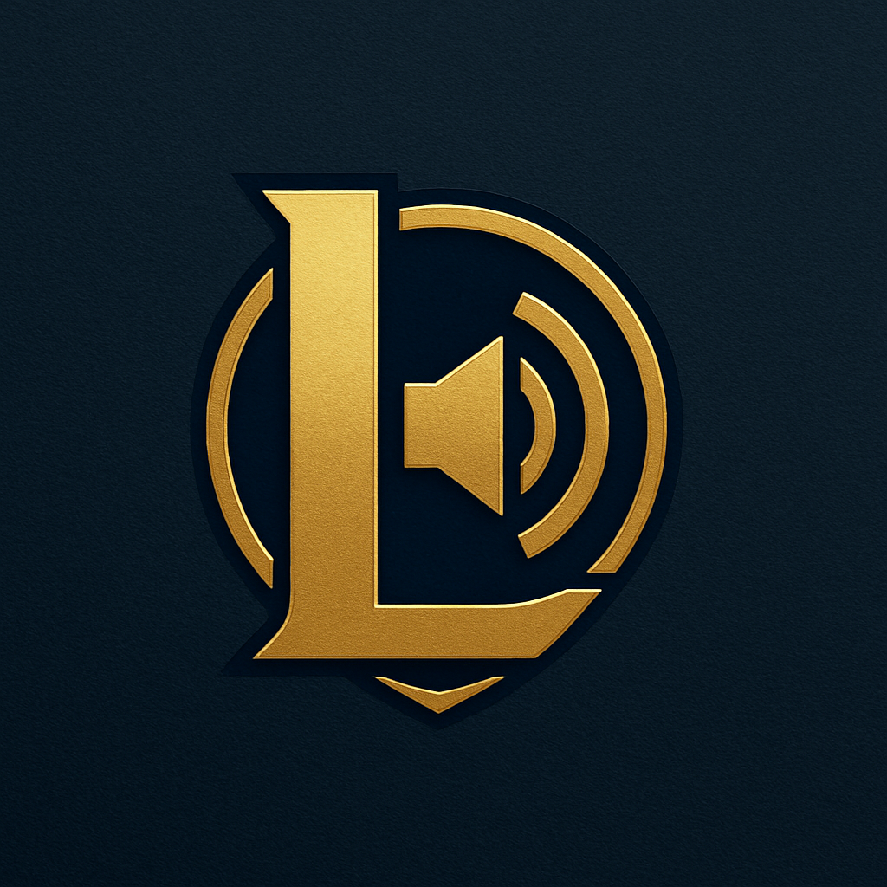

<h1 align="center">
   
  
   
  NexusVoice
   
</h1>

<h4 align="center">Um sistema de voz para o League of Legends, baseado em <a href="https://www.electronjs.org/" target="_blank">Electron</a>.</h4>

  <a href="#introdução">Introdução</a> •
  <a href="#instalação">Instalação</a> •
  <a href="#créditos">Créditos</a> •
  <a href="#licensa">Licensa</a>

<h1 align="center">
  
  
   
</h1>

## Introdução

O NexusVoice é um sistema de voz feito especialmente para quem joga League of Legends e quer se comunicar de um jeito simples e direto, sem complicações. Ao instalar o Nexus no seu computador, o programa vai automaticamente conectar você com seus aliados em um sistema de voz (os aliados também precisa ter o NexusVoice instalado). Portanto, ajude a divulgar o projeto!

## Instalação

Fazer ainda...

> **Nota:**
> Não testado no MacOS

## Créditos

Bom, a unica coisa que eu peguei de outro lugar, foi a logo, que foi feita no ChatGPT.

**Tecnologias utilizadas**

- [Electron](https://www.electronjs.org/)
- [Node.js](https://nodejs.org/)
- [Socket.IO](https://socket.io/) 
- [WebRTC](https://webrtc.org/)
- [Bootstrap](https://getbootstrap.com/)

## Licensa

MIT